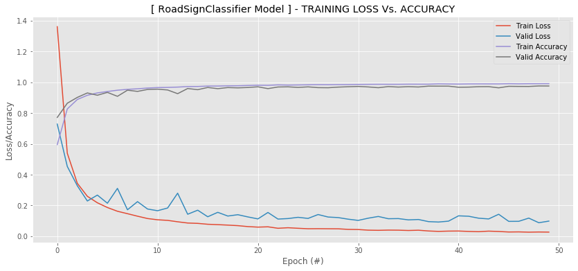

# Kenya Road Signs Classifier in Keras/TensorFlow

A CNN that classifies over 43 types of road signs in the Keras framework

Dataset: 

GTSRB dataset, a dataset with over 50,000 images of German Traffic Signs. There are 43 classes (43 different types of signs that we’re going to have to classify)

https://www.kaggle.com/meowmeowmeowmeowmeow/gtsrb-german-traffic-sign


```python
# Import required libraries 
# ------------------------------------------------------------------------------------------------------------------------------

import os, cv2, random, imutils

import pandas as pd
import numpy as np

import tensorflow as tf
from tensorflow.keras.models import Sequential, load_model
from tensorflow.keras.layers import BatchNormalization, Conv2D, MaxPooling2D, Activation, Flatten, Dropout, Dense
from tensorflow.keras.utils import to_categorical
from tensorflow.keras.preprocessing.image import ImageDataGenerator
from tensorflow.keras.optimizers import Adam

from sklearn.metrics import classification_report
from imutils import paths

import h5py

import matplotlib.pyplot as plt
```


```python
data_path = 'D:/AnacondaProjects/image_recognition/data/traffic_signs/Germany/'
class_names = pd.read_csv(data_path+'class_names.csv')
class_names = class_names['SignName']

img_size = 32
```


```python
# Function to laod image data
# ------------------------------------------------------------------------------------------------------------------------------
# - randomize data to prevent model from overfitting to specific classes.

def load_data(dataset, name):
    images = []
    classes = []
    
    rows = pd.read_csv(dataset)
    rows = rows.sample(frac=1).reset_index(drop=True)
    
    for i, row in rows.iterrows():
        img_class = row["ClassId"]
        img_path = row["Path"]
        image = os.path.join(data_path, img_path) # Full image path
        
        image = cv2.imread(image)
        image_rs = cv2.resize(image, (img_size, img_size), 3) # Model training faster with images of the same dimensions
        
        # histogram equalization - equalization technique which improves the contrast in images
        R, G, B = cv2.split(image_rs)
        img_r = cv2.equalizeHist(R)
        img_g = cv2.equalizeHist(G)
        img_b = cv2.equalizeHist(B)
        
        new_image = cv2.merge((img_r, img_g, img_b))
        
        #if i % 10000 == 0:
        #    print(f"Loaded: {i}") # Print load progress after each 10K images loaded
            
        images.append(new_image)
        classes.append(img_class)
        
    X = np.array(images)
    y = np.array(classes)
    
    #Randomize the order of the input images
    s=np.arange(X.shape[0])
    np.random.seed(43)
    np.random.shuffle(s)
    X=X[s]
    y=y[s]
    
    print('[INFO]: '+name+' Data Loaded == '+str(len(X)))
    return (X, y)
```


```python
# Load Data
# ------------------------------------------------------------------------------------------------------------------------------
%%time

train_data = data_path+'Train.csv'
test_data = data_path+'Test.csv'

(train_X, train_y) = load_data(train_data, 'Train')
(test_X, test_y) = load_data(test_data, 'Test')

```

    [INFO]: Train Data Loaded == 39209
    [INFO]: Test Data Loaded == 12630
    


```python
# Prepare the data for training
# ------------------------------------------------------------------------------------------------------------------------------
# - normalize the data i.e. scale down the values to be between 0 and 1, from before which was between 0 and 255.
# - one-hot encode the test and train labels
# - to account for inequalities in the classes assign a weight to each class.
%%time

print('[INFO]: Normalizing data...')

train_X = train_X.astype("float32") / 255.0
test_X = test_X.astype("float32") / 255.0

print('[INFO]: One-Hot Encoding data...')

num_labels = len(np.unique(train_y))
train_y = to_categorical(train_y, num_labels)
test_y = to_categorical(test_y, num_labels)

class_totals = train_y.sum(axis=0)
class_weight = class_totals.max() / class_totals
```

    [INFO]: Normalizing data...
    [INFO]: One-Hot Encoding data...
    

# Building & Training the Model


```python
# Define the Convolutional Newural Network Using TensorFlow Keras
# ------------------------------------------------------------------------------------------------------------------------------

class RoadSignClassifier:
    def createCNN(width, height, depth, classes):
        model = Sequential() #Sequential API allows creating the model layer-by-layer
        inputShape = (height, width, depth)
        
        model.add(Conv2D(8, (5, 5), input_shape=inputShape, activation="relu"))
        model.add(MaxPooling2D(pool_size=(2, 2)))
        
        model.add(Conv2D(16, (3, 3), activation="relu"))
        model.add(BatchNormalization())
        model.add(Conv2D(16, (3, 3), activation="relu"))
        model.add(BatchNormalization())
        model.add(MaxPooling2D(pool_size=(2, 2)))
 
        model.add(Conv2D(32, (3, 3), padding="same", activation="relu"))
        model.add(BatchNormalization())
        model.add(Conv2D(32, (3, 3), padding="same", activation="relu"))
        model.add(BatchNormalization())
        
        model.add(Flatten())
        model.add(Dropout(0.5))
        model.add(Dense(512, activation="relu"))
        model.add(Dense(classes, activation="softmax"))
        
        return model
```


```python
# Train the Model
# ------------------------------------------------------------------------------------------------------------------------------
# - Use ImageDataGenerator module to perform data augmentation
# - data_aug = create modified versions of the images to add images to our dataset without us having to collect new ones.
%%time

print('[INFO]: Setting Hyperparameters...')
epochs = 50
learning_rate = 0.001 #0.001
batch_size = 32

print('[INFO]: Performing Data Augmentation...')
data_aug = ImageDataGenerator(rotation_range=10,
                              zoom_range=0.15,
                              width_shift_range=0.1,
                              height_shift_range=0.1,
                              shear_range=0.15,
                              horizontal_flip=False,
                              vertical_flip=False,
                              fill_mode='nearest')

print('[INFO]: Defining CNN Model...')
model = RoadSignClassifier.createCNN(width=32, height=32, depth=3, classes=43)
optimizer = Adam(lr=learning_rate, decay=learning_rate / (epochs*0.5))

print('[INFO]: Compiling the model...')
model.compile(optimizer=optimizer, loss="categorical_crossentropy", metrics=["accuracy"])

fit = model.fit(data_aug.flow(train_X, train_y, batch_size=batch_size),
                          epochs=epochs,
                          validation_data=(test_X, test_y),
                          class_weight=class_weight,
                          verbose=1)
```

    [INFO]: Setting Hyperparameters...
    [INFO]: Performing Data Augmentation...
    [INFO]: Defining CNN Model...
    [INFO]: Compiling the model...
    Train for 1226 steps, validate on 12630 samples
    Epoch 1/50
    1226/1226 [==============================] - 63s 52ms/step - loss: 1.3618 - accuracy: 0.5949 - val_loss: 0.7287 - val_accuracy: 0.7717
    Epoch 2/50
    1226/1226 [==============================] - 63s 51ms/step - loss: 0.5390 - accuracy: 0.8267 - val_loss: 0.4535 - val_accuracy: 0.8641
    Epoch 3/50
    1226/1226 [==============================] - 70s 57ms/step - loss: 0.3436 - accuracy: 0.8883 - val_loss: 0.3278 - val_accuracy: 0.9019
    Epoch 4/50
    1226/1226 [==============================] - 63s 52ms/step - loss: 0.2592 - accuracy: 0.9157 - val_loss: 0.2288 - val_accuracy: 0.9309
    Epoch 5/50
    1226/1226 [==============================] - 69s 56ms/step - loss: 0.2172 - accuracy: 0.9311 - val_loss: 0.2671 - val_accuracy: 0.9160
    Epoch 6/50
    1226/1226 [==============================] - 66s 54ms/step - loss: 0.1862 - accuracy: 0.9402 - val_loss: 0.2143 - val_accuracy: 0.9345
    Epoch 7/50
    1226/1226 [==============================] - 75s 61ms/step - loss: 0.1625 - accuracy: 0.9486 - val_loss: 0.3107 - val_accuracy: 0.9089
    Epoch 8/50
    1226/1226 [==============================] - 63s 51ms/step - loss: 0.1462 - accuracy: 0.9542 - val_loss: 0.1717 - val_accuracy: 0.9488
    Epoch 9/50
    1226/1226 [==============================] - 61s 50ms/step - loss: 0.1299 - accuracy: 0.9578 - val_loss: 0.2246 - val_accuracy: 0.9409
    Epoch 10/50
    1226/1226 [==============================] - 60s 49ms/step - loss: 0.1148 - accuracy: 0.9629 - val_loss: 0.1766 - val_accuracy: 0.9535
    Epoch 11/50
    1226/1226 [==============================] - 60s 49ms/step - loss: 0.1067 - accuracy: 0.9658 - val_loss: 0.1656 - val_accuracy: 0.9554
    Epoch 12/50
    1226/1226 [==============================] - 60s 49ms/step - loss: 0.1028 - accuracy: 0.9667 - val_loss: 0.1832 - val_accuracy: 0.9502
    Epoch 13/50
    1226/1226 [==============================] - 60s 49ms/step - loss: 0.0937 - accuracy: 0.9689 - val_loss: 0.2795 - val_accuracy: 0.9261
    Epoch 14/50
    1226/1226 [==============================] - 68s 55ms/step - loss: 0.0856 - accuracy: 0.9724 - val_loss: 0.1427 - val_accuracy: 0.9597
    Epoch 15/50
    1226/1226 [==============================] - 76s 62ms/step - loss: 0.0833 - accuracy: 0.9729 - val_loss: 0.1690 - val_accuracy: 0.9520
    Epoch 16/50
    1226/1226 [==============================] - 76s 62ms/step - loss: 0.0776 - accuracy: 0.9755 - val_loss: 0.1263 - val_accuracy: 0.9664
    Epoch 17/50
    1226/1226 [==============================] - 63s 51ms/step - loss: 0.0750 - accuracy: 0.9758 - val_loss: 0.1552 - val_accuracy: 0.9587
    Epoch 18/50
    1226/1226 [==============================] - 71s 58ms/step - loss: 0.0721 - accuracy: 0.9771 - val_loss: 0.1310 - val_accuracy: 0.9659
    Epoch 19/50
    1226/1226 [==============================] - 71s 58ms/step - loss: 0.0685 - accuracy: 0.9775 - val_loss: 0.1397 - val_accuracy: 0.9638
    Epoch 20/50
    1226/1226 [==============================] - 67s 54ms/step - loss: 0.0624 - accuracy: 0.9795 - val_loss: 0.1253 - val_accuracy: 0.9663
    Epoch 21/50
    1226/1226 [==============================] - 159s 129ms/step - loss: 0.0590 - accuracy: 0.9809 - val_loss: 0.1124 - val_accuracy: 0.9708
    Epoch 22/50
    1226/1226 [==============================] - 85s 69ms/step - loss: 0.0610 - accuracy: 0.9805 - val_loss: 0.1542 - val_accuracy: 0.9589
    Epoch 23/50
    1226/1226 [==============================] - 75s 61ms/step - loss: 0.0515 - accuracy: 0.9834 - val_loss: 0.1113 - val_accuracy: 0.9695
    Epoch 24/50
    1226/1226 [==============================] - 74s 61ms/step - loss: 0.0550 - accuracy: 0.9821 - val_loss: 0.1147 - val_accuracy: 0.9706
    Epoch 25/50
    1226/1226 [==============================] - 72s 59ms/step - loss: 0.0515 - accuracy: 0.9829 - val_loss: 0.1227 - val_accuracy: 0.9667
    Epoch 26/50
    1226/1226 [==============================] - 80s 65ms/step - loss: 0.0484 - accuracy: 0.9840 - val_loss: 0.1156 - val_accuracy: 0.9704
    Epoch 27/50
    1226/1226 [==============================] - 76s 62ms/step - loss: 0.0488 - accuracy: 0.9846 - val_loss: 0.1408 - val_accuracy: 0.9654
    Epoch 28/50
    1226/1226 [==============================] - 71s 58ms/step - loss: 0.0484 - accuracy: 0.9842 - val_loss: 0.1246 - val_accuracy: 0.9647
    Epoch 29/50
    1226/1226 [==============================] - 75s 61ms/step - loss: 0.0481 - accuracy: 0.9849 - val_loss: 0.1210 - val_accuracy: 0.9688
    Epoch 30/50
    1226/1226 [==============================] - 80s 66ms/step - loss: 0.0443 - accuracy: 0.9854 - val_loss: 0.1106 - val_accuracy: 0.9712
    Epoch 31/50
    1226/1226 [==============================] - 82s 67ms/step - loss: 0.0434 - accuracy: 0.9864 - val_loss: 0.1027 - val_accuracy: 0.9732
    Epoch 32/50
    1226/1226 [==============================] - 76s 62ms/step - loss: 0.0393 - accuracy: 0.9870 - val_loss: 0.1171 - val_accuracy: 0.9699
    Epoch 33/50
    1226/1226 [==============================] - 80s 65ms/step - loss: 0.0382 - accuracy: 0.9873 - val_loss: 0.1283 - val_accuracy: 0.9649
    Epoch 34/50
    1226/1226 [==============================] - 82s 67ms/step - loss: 0.0396 - accuracy: 0.9872 - val_loss: 0.1136 - val_accuracy: 0.9722
    Epoch 35/50
    1226/1226 [==============================] - 76s 62ms/step - loss: 0.0392 - accuracy: 0.9872 - val_loss: 0.1145 - val_accuracy: 0.9691
    Epoch 36/50
    1226/1226 [==============================] - 71s 58ms/step - loss: 0.0371 - accuracy: 0.9880 - val_loss: 0.1061 - val_accuracy: 0.9717
    Epoch 37/50
    1226/1226 [==============================] - 73s 60ms/step - loss: 0.0389 - accuracy: 0.9878 - val_loss: 0.1086 - val_accuracy: 0.9696
    Epoch 38/50
    1226/1226 [==============================] - 77s 63ms/step - loss: 0.0340 - accuracy: 0.9879 - val_loss: 0.0948 - val_accuracy: 0.9753
    Epoch 39/50
    1226/1226 [==============================] - 75s 61ms/step - loss: 0.0313 - accuracy: 0.9902 - val_loss: 0.0920 - val_accuracy: 0.9751
    Epoch 40/50
    1226/1226 [==============================] - 75s 61ms/step - loss: 0.0331 - accuracy: 0.9893 - val_loss: 0.0979 - val_accuracy: 0.9751
    Epoch 41/50
    1226/1226 [==============================] - 101s 82ms/step - loss: 0.0336 - accuracy: 0.9885 - val_loss: 0.1324 - val_accuracy: 0.9679
    Epoch 42/50
    1226/1226 [==============================] - 100s 82ms/step - loss: 0.0310 - accuracy: 0.9896 - val_loss: 0.1297 - val_accuracy: 0.9687
    Epoch 43/50
    1226/1226 [==============================] - 88s 72ms/step - loss: 0.0293 - accuracy: 0.9899 - val_loss: 0.1170 - val_accuracy: 0.9714
    Epoch 44/50
    1226/1226 [==============================] - 87s 71ms/step - loss: 0.0330 - accuracy: 0.9898 - val_loss: 0.1122 - val_accuracy: 0.9718
    Epoch 45/50
    1226/1226 [==============================] - 78s 64ms/step - loss: 0.0307 - accuracy: 0.9896 - val_loss: 0.1426 - val_accuracy: 0.9641
    Epoch 46/50
    1226/1226 [==============================] - 76s 62ms/step - loss: 0.0273 - accuracy: 0.9913 - val_loss: 0.0964 - val_accuracy: 0.9740
    Epoch 47/50
    1226/1226 [==============================] - 76s 62ms/step - loss: 0.0280 - accuracy: 0.9902 - val_loss: 0.0967 - val_accuracy: 0.9732
    Epoch 48/50
    1226/1226 [==============================] - 81s 66ms/step - loss: 0.0262 - accuracy: 0.9910 - val_loss: 0.1176 - val_accuracy: 0.9730
    Epoch 49/50
    1226/1226 [==============================] - 84s 68ms/step - loss: 0.0273 - accuracy: 0.9911 - val_loss: 0.0875 - val_accuracy: 0.9762
    Epoch 50/50
    1226/1226 [==============================] - 77s 63ms/step - loss: 0.0266 - accuracy: 0.9912 - val_loss: 0.0982 - val_accuracy: 0.9760
    


```python
model.summary()
```

    Model: "sequential"
    _________________________________________________________________
    Layer (type)                 Output Shape              Param #   
    =================================================================
    conv2d (Conv2D)              (None, 28, 28, 8)         608       
    _________________________________________________________________
    max_pooling2d (MaxPooling2D) (None, 14, 14, 8)         0         
    _________________________________________________________________
    conv2d_1 (Conv2D)            (None, 12, 12, 16)        1168      
    _________________________________________________________________
    batch_normalization (BatchNo (None, 12, 12, 16)        64        
    _________________________________________________________________
    conv2d_2 (Conv2D)            (None, 10, 10, 16)        2320      
    _________________________________________________________________
    batch_normalization_1 (Batch (None, 10, 10, 16)        64        
    _________________________________________________________________
    max_pooling2d_1 (MaxPooling2 (None, 5, 5, 16)          0         
    _________________________________________________________________
    conv2d_3 (Conv2D)            (None, 5, 5, 32)          4640      
    _________________________________________________________________
    batch_normalization_2 (Batch (None, 5, 5, 32)          128       
    _________________________________________________________________
    conv2d_4 (Conv2D)            (None, 5, 5, 32)          9248      
    _________________________________________________________________
    batch_normalization_3 (Batch (None, 5, 5, 32)          128       
    _________________________________________________________________
    flatten (Flatten)            (None, 800)               0         
    _________________________________________________________________
    dropout (Dropout)            (None, 800)               0         
    _________________________________________________________________
    dense (Dense)                (None, 512)               410112    
    _________________________________________________________________
    dense_1 (Dense)              (None, 43)                22059     
    =================================================================
    Total params: 450,539
    Trainable params: 450,347
    Non-trainable params: 192
    _________________________________________________________________
    


```python
# Evaluate the Model per Traffic Sign Class
# ------------------------------------------------------------------------------------------------------------------------------
%%time

print("[INFO] Evaluating Model...")

predictions = model.predict(test_X, batch_size=batch_size)
print(classification_report(test_y.argmax(axis=1),
                            predictions.argmax(axis=1), 
                            target_names=class_names))

```

    [INFO] Evaluating Model...
                                                        precision    recall  f1-score   support
    
                                  Speed limit (20km/h)       1.00      0.93      0.97        60
                                  Speed limit (30km/h)       1.00      0.99      0.99       720
                                  Speed limit (50km/h)       0.99      0.99      0.99       750
                                  Speed limit (60km/h)       0.99      0.91      0.95       450
                                  Speed limit (70km/h)       0.99      0.97      0.98       660
                                  Speed limit (80km/h)       0.91      0.98      0.94       630
                           End of speed limit (80km/h)       1.00      0.86      0.92       150
                                 Speed limit (100km/h)       0.97      0.98      0.98       450
                                 Speed limit (120km/h)       0.99      0.98      0.98       450
                                            No passing       0.99      1.00      0.99       480
          No passing for vehicles over 3.5 metric tons       1.00      0.98      0.99       660
                 Right-of-way at the next intersection       0.94      0.98      0.96       420
                                         Priority road       0.99      0.99      0.99       690
                                                 Yield       1.00      1.00      1.00       720
                                                  Stop       0.97      1.00      0.99       270
                                           No vehicles       1.00      0.98      0.99       210
              Vehicles over 3.5 metric tons prohibited       0.99      1.00      1.00       150
                                              No entry       1.00      0.96      0.98       360
                                       General caution       0.99      0.91      0.95       390
                           Dangerous curve to the left       1.00      1.00      1.00        60
                          Dangerous curve to the right       0.92      0.99      0.95        90
                                          Double curve       0.90      0.93      0.92        90
                                            Bumpy road       1.00      0.95      0.97       120
                                         Slippery road       0.95      1.00      0.97       150
                             Road narrows on the right       0.97      0.99      0.98        90
                                             Road work       0.99      0.98      0.99       480
                                       Traffic signals       0.88      0.99      0.93       180
                                           Pedestrians       0.82      0.82      0.82        60
                                     Children crossing       0.97      0.99      0.98       150
                                     Bicycles crossing       0.96      1.00      0.98        90
                                    Beware of ice/snow       0.94      0.75      0.84       150
                                 Wild animals crossing       0.96      1.00      0.98       270
                   End of all speed and passing limits       0.91      1.00      0.95        60
                                      Turn right ahead       0.98      1.00      0.99       210
                                       Turn left ahead       1.00      1.00      1.00       120
                                            Ahead only       1.00      0.98      0.99       390
                                  Go straight or right       0.99      1.00      1.00       120
                                   Go straight or left       0.97      1.00      0.98        60
                                            Keep right       1.00      1.00      1.00       690
                                             Keep left       0.98      0.99      0.98        90
                                  Roundabout mandatory       0.85      0.94      0.89        90
                                     End of no passing       0.98      0.93      0.96        60
    End of no passing by vehicles over 3.5 metric tons       0.86      1.00      0.92        90
    
                                              accuracy                           0.98     12630
                                             macro avg       0.96      0.97      0.97     12630
                                          weighted avg       0.98      0.98      0.98     12630
    
    


```python
# CNN Model accuracy / val_accuracy
# ------------------------------------------------------------------------------------------------------------------------------

acc = round(fit.history['accuracy'][-1]*100,2)
val_acc = round(fit.history['val_accuracy'][-1]*100,2)

print('Train Accuracy      == '+str(acc)+'%')
print('Validation Accuracy == '+str(val_acc)+'%')

```

    Train Accuracy      == 99.12%
    Validation Accuracy == 97.6%
    


```python
# plot the training loss and accuracy
# ------------------------------------------------------------------------------------------------------------------------------

N = np.arange(0, epochs)

plt.style.use("ggplot")
plt.figure(figsize=(14,6))

plt.plot(N, fit.history["loss"], label="Train Loss")
plt.plot(N, fit.history["val_loss"], label="Valid Loss")
plt.plot(N, fit.history["accuracy"], label="Train Accuracy")
plt.plot(N, fit.history["val_accuracy"], label="Valid Accuracy")

plt.title("[ RoadSignClassifier Model ] - TRAINING LOSS Vs. ACCURACY")
plt.xlabel("Epoch (#)")
plt.ylabel("Loss/Accuracy")
plt.legend(loc="upper right")

plt.show()
#plt.savefig(args["plot"])
```





```python
# Save the entire model to a HDF5 file.
# ------------------------------------------------------------------------------------------------------------------------------
# - The '.h5' extension indicates that the model should be saved to HDF5.

model.save('model_RoadSignClassifier.h5') 
print('[INFO]: Model SAVED!')
```

    [INFO]: Model SAVED!
    

# Predicting Using the Model Saved


```python
# Load saved RoadSignClassifier
# ------------------------------------------------------------------------------------------------------------------------------
%%time

print("[INFO]: Loading Pre-trained Model...")

model = load_model('model_RoadSignClassifier.h5')
 
# Get image to predict
print("[INFO]: Predicting Traffic Sign...")

img = r'Predict/60-speed-limit' #60-speed-limit.png
img_path = data_path+img+'.png'

image = cv2.imread(img_path)

image_rs = cv2.resize(image, (img_size, img_size), 3) # Model training faster with images of the same dimensions

# histogram equalization - equalization technique which improves the contrast in images
R, G, B = cv2.split(image_rs)
img_r = cv2.equalizeHist(R)
img_g = cv2.equalizeHist(G)
img_b = cv2.equalizeHist(B)

image = cv2.merge((img_r, img_g, img_b))

# preprocess the image by scaling it to the range [0, 1]
image = image.astype("float32") / 255.0
image = np.expand_dims(image, axis=0)

# make predictions using the traffic sign recognizer CNN
preds = model.predict(image)
j = preds.argmax(axis=1)[0]
label = class_names[j]
print('Predicted Label == '+label)

# load the image using OpenCV, resize it, and draw the label on it
image = cv2.imread(img_path)
image = imutils.resize(image, width=128)
cv2.putText(image, label, (5, 15), 
                cv2.FONT_HERSHEY_SIMPLEX,
                0.45, (0, 0, 255), 2)

# save the image to disk
p = data_path+img+'_PRED.png'
w = cv2.imwrite(p, image)
print('[ DONE ]')
```

    [INFO]: Loading Pre-trained Model...
    [INFO]: Predicting Traffic Sign...
    Predicted Label == General caution
    [ DONE ]
    


```python

```
